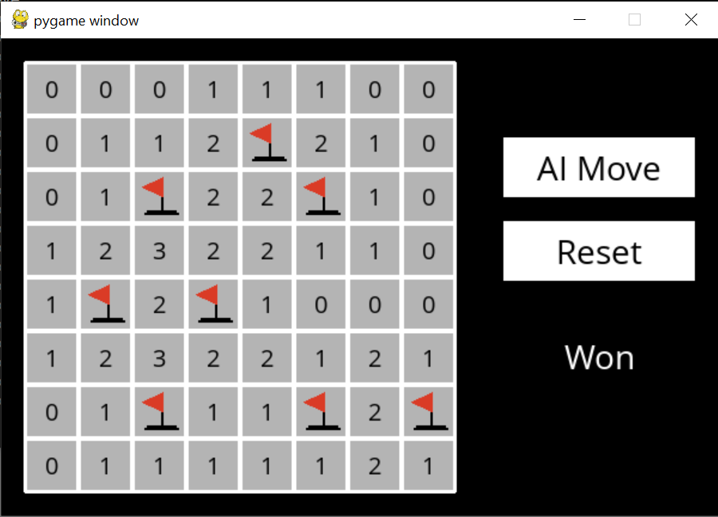

# Minesweeper
(CS50:AI PROJECT)
AI to play Minesweeper.


### Background
Minesweeper is a puzzle game that consists of a grid of cells, where some of the cells contain hidden “mines.” Clicking on a cell that contains a mine detonates the mine, and causes the user to lose the game. Clicking on a “safe” cell (i.e., a cell that does not contain a mine) reveals a number that indicates how many neighboring cells – where a neighbor is a cell that is one square to the left, right, up, down, or diagonal from the given cell – contain a mine.

In this 3x3 Minesweeper game, for example, the three 1 values indicate that each of those cells has one neighboring cell that is a mine. The four 0 values indicate that each of those cells has no neighboring mine.


Given this information, a logical player could conclude that there must be a mine in the lower-right cell and that there is no mine in the upper-left cell, for only in that case would the numerical labels on each of the other cells be accurate.

The goal of the game is to flag (i.e., identify) each of the mines. In many implementations of the game, including the one in this project, the player can flag a mine by right-clicking on a cell (or two-finger clicking, depending on the computer).

### Getting Started

Once in the directory for the project, run 
```python
pip3 install -r requirements.txt
```
to install the required Python package (pygame) for this project if you don’t already have it installed.
then run 
```python
python rynner.py
```
to execute the program.

